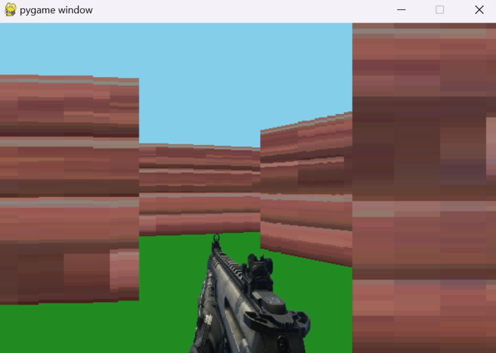

The Maze

The Maze is a 3D Maze game that uses ray casting to render a 2D maze into a 3D world! 

# 🕹️ Raycast 2D Game: From C to Python Adventure

I’ve always been fascinated by how early video games managed to create immersive worlds with minimal computing resources. Inspired by classics like Wolfenstein 3D, I set out to build my own 2D raycasting game engine. What started as a challenge to push my C and SDL2 skills evolved into an even deeper exploration when I transitioned the project to Python.

This project is more than a technical exercise; it’s my way of rediscovering the simplicity and creativity of early game design.


The Maze was written in Python with using Pygame and Ray-casting technique to render the walls into 3D world. Deveploment was performed using Ubuntu 24.04

About Raycasting;

Ray-casting sensation began with the release of a game, Wolfenstein 3D (iD Software), in 1992. In Wolfenstein 3D, the player is placed on a three dimensional maze-like environment, where he/she must find an exit while battling multiple opponents. Wolfenstein 3D becomes an instant classic for its fast and smooth animation. What enables this kind of animation is an innovative approach to three dimensional rendering known as “ray-casting.”


## Technical Challenges

One of the biggest technical hurdles was handling real-time rendering in Python without using SDL2. In C, SDL2 provides a great abstraction for handling input, rendering, and audio, but moving to Python meant I had to find libraries that could match the performance while being easier to integrate.

### Raycasting Algorithm
The core of the project is a simple yet efficient raycasting engine. For each frame, the engine shoots rays from the player's point of view, checks for collisions with walls, and renders the environment in 2D. Here's a breakdown of the steps:
- **Step 1**: Cast a ray for each vertical strip on the screen.
- **Step 2**: For each ray, calculate the distance to the nearest wall.
- **Step 3**: Scale the wall slice height based on distance to simulate depth.
- **Step 4**: Repeat for the entire viewport to build the full scene.


### Optimization Challenges
One challenge with Python was maintaining smooth frame rates, especially with collision detection.  In Python, I had to manually optimize by:
- Using `Pygame` for lightweight rendering
- Implementing broad-phase collision detection to reduce the number of checks


## Installation and Usage

### Prerequisites:
- Python 3.x
- Pygame (for rendering)

### Instructions:
1. Clone the repo:
   ```bash
   git clone https://github.com/Boodenator/The_Maze_Project.git

Usage

Execute: type --->> python main.py

Use up and down arrow keys to move forward and backward,
Use right and left arrow keys to turn the camera arround,
press space to shoot the enemy infront of the player.

Demo

[The Maze Demo]
[](https://youtu.be/QM02QK6feBo)




Author ✒️

Abdelrahman Ahmed


